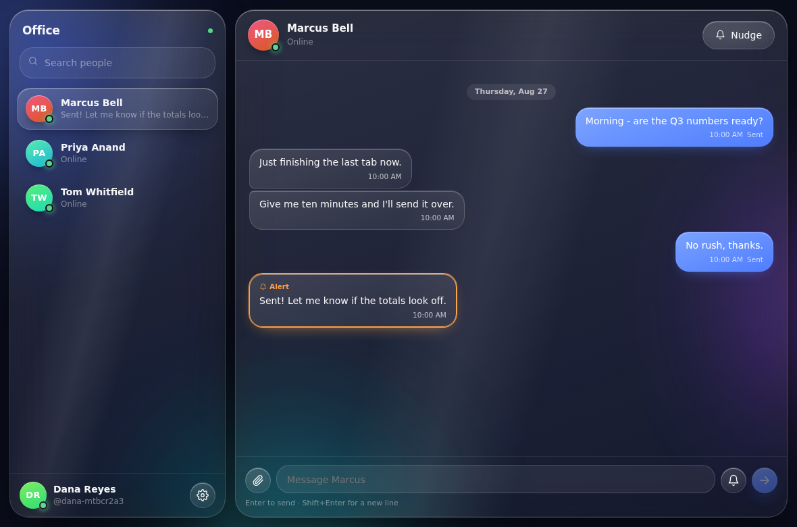
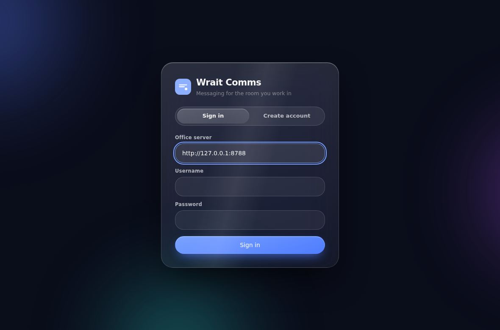
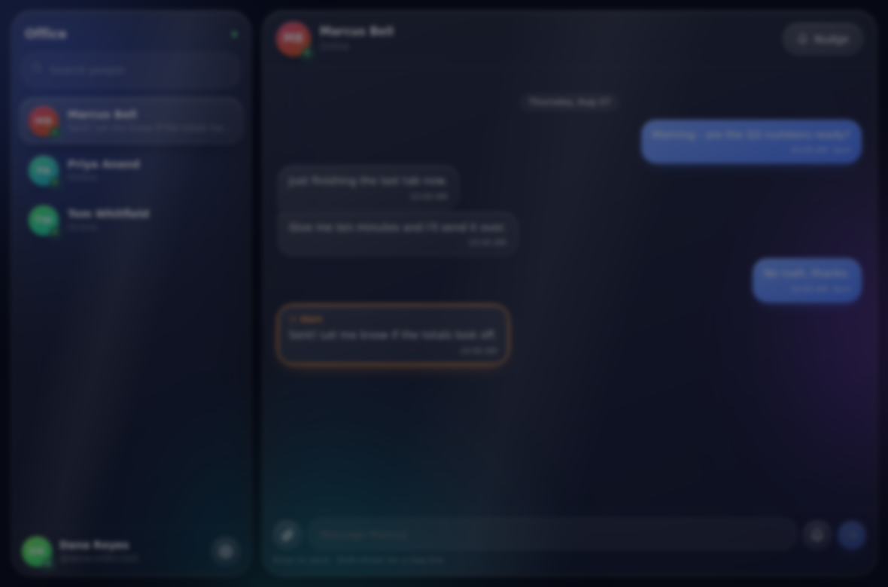
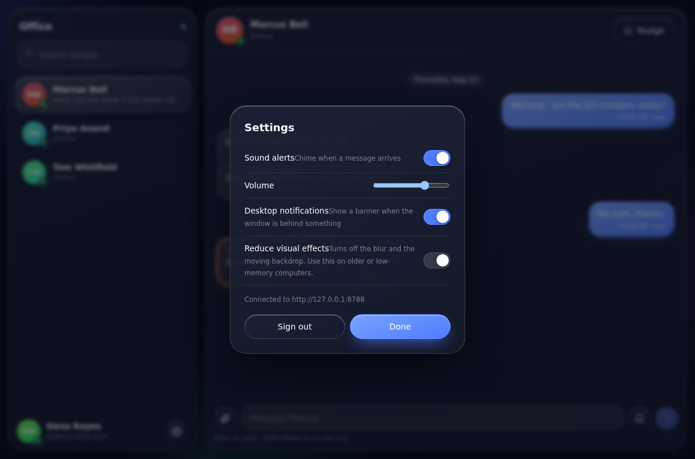

# Wrait Comms

Messaging between the computers in one office. Chat, a sound alert on the other
person's machine, and file transfer — over your own network, with no external
service involved.

Runs on **Windows, macOS and iOS** from one shared codebase.



## Why this architecture

You asked for either a native monorepo per platform, or one shared codebase.
Tauri v2 is both at once, which is why it was chosen:

| | Tauri v2 | Electron | React Native |
|---|---|---|---|
| One shared codebase | yes | yes | mostly |
| Native binary per platform | yes | yes | yes |
| iOS support | yes | **no** | yes |
| Idle RAM per client | **~60–90 MB** | 300–500 MB | ~120 MB |
| Installer size | ~8 MB | ~85 MB | n/a |

Tauri renders through the webview the OS already has loaded — WebView2 on
Windows, WKWebView on macOS and iOS — instead of shipping a private copy of
Chromium. That is what keeps the memory footprint low enough for the older
machines in the office, and it is why Electron was ruled out on two counts
rather than one.

The shipped frontend is 63 KB gzipped in total.

## Layout

```
packages/protocol/   Wire types and constants, imported by BOTH sides
apps/server/         The office relay: accounts, presence, messages, files
apps/desktop/        The client, built for Windows / macOS / iOS
  src-tauri/         The Rust shell and per-platform bundling
```

`packages/protocol` is plain ESM with a sibling `.d.ts`, so the Node server and
the TypeScript client import the *same file*. There is no build step between
them and no duplicated shape that can drift.

## Running it

### 1. The relay

One always-on machine in the office runs this. It needs nothing but Node 22+ —
storage is Node's built-in SQLite, so there is no database to install and no
native module to compile.

```bash
pnpm install
pnpm server
```

It prints the LAN address to give everyone:

```
Wrait Comms relay listening on 0.0.0.0:8787
  point clients at:  http://192.168.1.20:8787
```

### 2. The client

```bash
pnpm dev                       # in a browser, for development
pnpm --filter @comms/desktop tauri dev     # in the real native shell
```

Each person enters the relay address once, creates an account, and stays signed
in after that.

### Building installers

Each command must run **on** the target platform (Apple's toolchain is macOS
only; the Windows installer needs Windows):

```bash
pnpm --filter @comms/desktop tauri build              # .msi / .exe  on Windows
pnpm --filter @comms/desktop tauri build              # .app / .dmg  on macOS
pnpm --filter @comms/desktop tauri ios init           # once
pnpm --filter @comms/desktop tauri ios build          # .ipa         on macOS
```

## How the pieces work

**Accounts.** Username and password, hashed with scrypt (N=16384) and a
per-user salt. Sessions are random 256-bit tokens, stored *hashed*, so a copy
of the database cannot be replayed as a login. A failed login runs a decoy
verification so a nonexistent account takes the same time as a wrong password.

**Messages.** One WebSocket per client. A person may be signed in from several
machines — desk PC, laptop, phone — and every one of them receives each
message, so a conversation stays in sync everywhere. The socket reconnects on
its own with jittered backoff, and the server replays recent history on
connect, which is how anything missed while disconnected gets filled in.

**Sound alerts.** Two levels. Any message can be flagged as an *alert*, which
plays a brighter chime on the recipient's machine and outlines the bubble. A
*nudge* is a standalone attention-grab: an insistent tone plus a full-window
pulse. Both also ask the native shell to bounce the dock icon (macOS) or flash
the taskbar button (Windows), so they land even when the window is buried.

Tones are synthesised with WebAudio rather than shipped as audio files — a few
hundred bytes of code instead of decoded audio held in memory, and identical on
every platform.

**File transfer.** Files are split into 512 KiB chunks and each chunk is
written at its own byte offset in the destination file. Three consequences:
chunks may arrive in any order, an interrupted upload resumes from what the
server already holds, and only one chunk is ever resident in memory — a 1 GB
transfer costs the same RAM as a 1 MB one. Downloads are authorized: only the
sender and the named recipient can fetch a file. Limit is 2 GB.

**Low-memory mode.** Backdrop blur is the most expensive thing this UI does and
it is recomposited every frame. Settings → *Reduce visual effects* drops the
blur, the animated backdrop and the specular sweep, keeping the layout and the
palette. The OS-level `prefers-reduced-transparency` and
`prefers-reduced-motion` settings are honoured too.

## The look

The glass is built from portable CSS primitives rather than Apple's native
material, which is only available to recent SwiftUI. That means it renders the
same on WKWebView and WebView2. The recipe is in
[`src/styles/glass.css`](apps/desktop/src/styles/glass.css): a blurred,
saturation-boosted backdrop sample; a bright specular rim along the top edge;
a very soft oversized drop shadow; large corner radii; and a slowly drifting
coloured backdrop for the glass to pick colour from.

Dark and light are both supported, following the OS setting.

| Sign in | Settings | Reduced effects |
|---|---|---|
|  |  |  |

On iPhone the two panes collapse to one: the roster is the root screen and a
conversation slides over it.

## Tests

```bash
pnpm test                                   # server, end to end
pnpm --filter @comms/desktop e2e            # the real UI in a browser
```

The server suite drives a live relay: registration, login (including the
timing-equalised failure path), message delivery with alerts, nudges, presence
transitions, read receipts, and a two-chunk file round trip verified by hash
along with its authorization boundaries.

The browser suite signs two accounts up in separate browser contexts — two
different machines — and has them chat, alert each other and exchange a 700 KB
file, checking the downloaded bytes match what was sent.

## Security notes

Run the relay on the office LAN. If you expose it to the internet, put it
behind TLS (a reverse proxy is fine) — the client will use `wss://`
automatically when given an `https://` address. Passwords are never stored in
recoverable form, but the transport is only as private as you make it.
