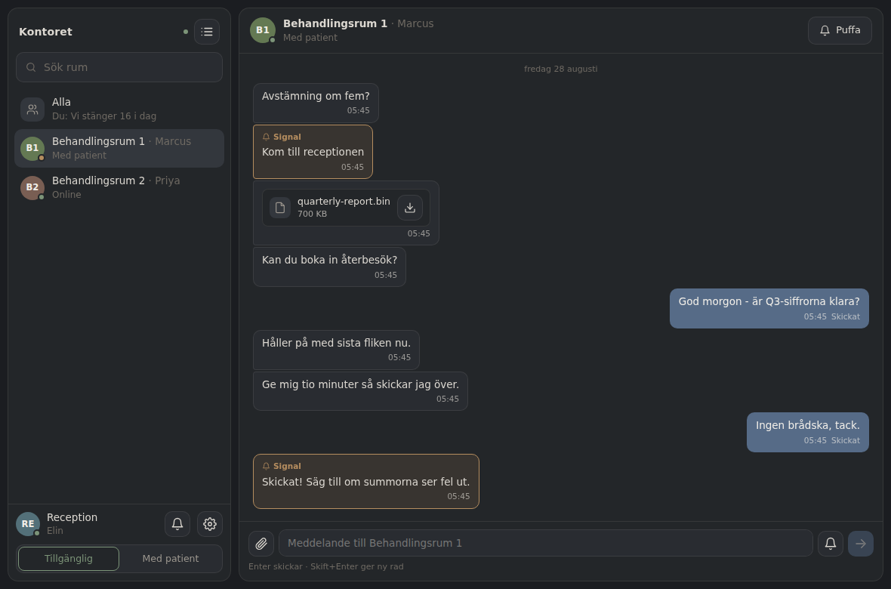
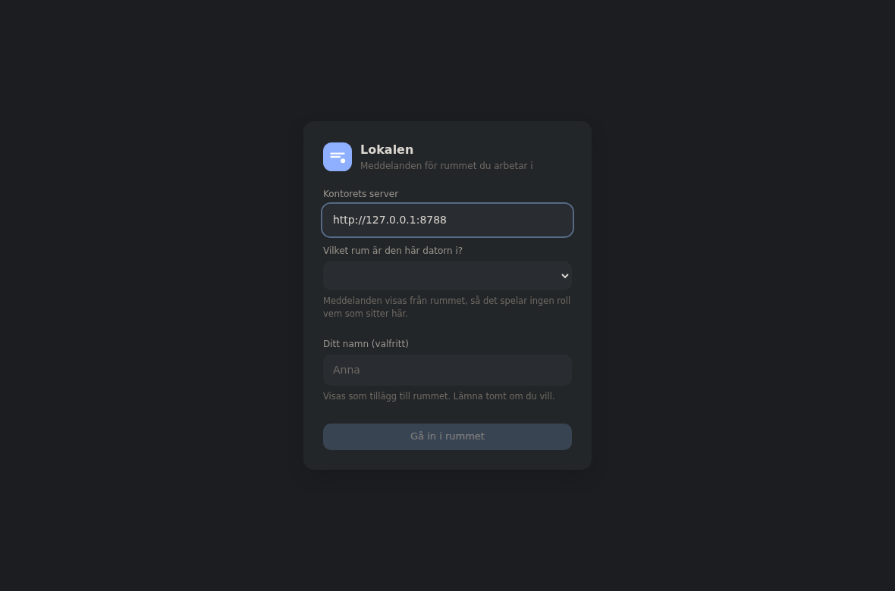
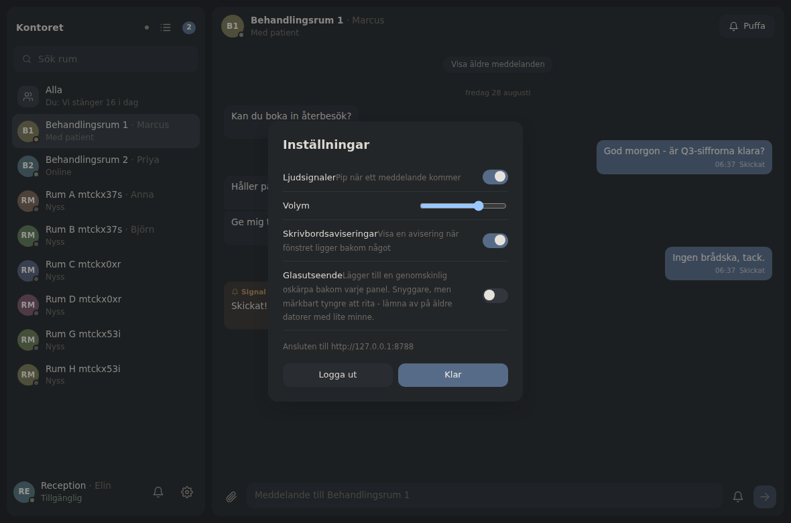
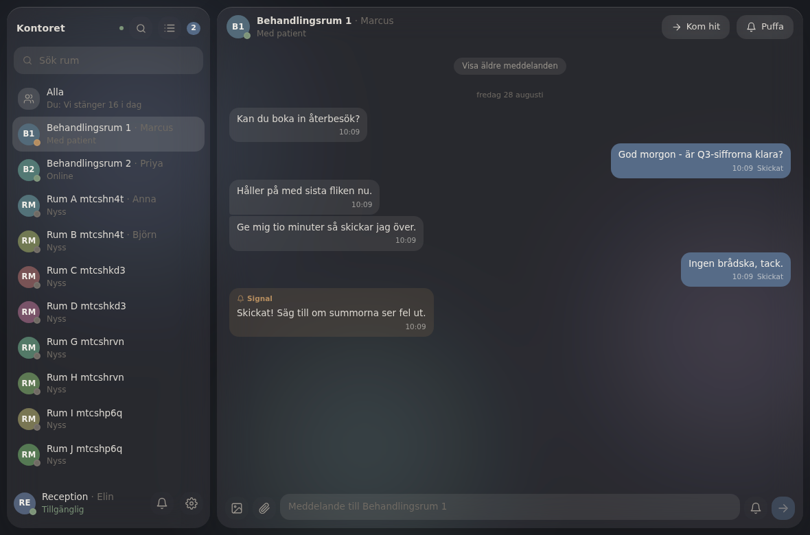

# Lokalen

Messaging between the computers in one office. Chat, a sound alert on the other
person's machine, file transfer, and a shared to-do list — over your own
network, with no external service involved.

Runs on **Windows, macOS and iOS** from one shared codebase.

**The interface is in Swedish.** These developer notes are in English; say the
word and they can be translated too.



## Why this architecture

You asked for either a native monorepo per platform, or one shared codebase.
Tauri v2 is both at once, which is why it was chosen:

| | Tauri v2 | Electron | React Native |
|---|---|---|---|
| One shared codebase | yes | yes | mostly |
| Native binary per platform | yes | yes | yes |
| iOS support | yes | **no** | yes |
| Idle RAM per client | **~60–90 MB** | 300–500 MB | ~120 MB |
| Installer size | ~8 MB | ~85 MB | n/a |

Tauri renders through the webview the OS already has loaded — WebView2 on
Windows, WKWebView on macOS and iOS — instead of shipping a private copy of
Chromium. That is what keeps the memory footprint low enough for the older
machines in the office, and it is why Electron was ruled out on two counts
rather than one.

The shipped frontend is 63 KB gzipped in total.

## Layout

```
packages/protocol/   Wire types and constants, imported by BOTH sides
apps/server/         The relay as a Node service, for an always-on machine
apps/desktop/        The client, built for Windows / macOS / iOS
  src-tauri/         The Rust shell, per-platform bundling, and
    src/relay/       ...the same relay compiled into the app itself
```

There are two interchangeable relay implementations speaking one protocol:

| | `apps/server` (Node) | `src-tauri/src/relay` (Rust) |
|---|---|---|
| Runs as | a service on an always-on machine | inside the app, or as a `relay` binary |
| Needs installed | Node 22+ | nothing |
| Best for | a server that should never show a GUI | the portable exe, and small offices |

They are not "similar" — the browser suite runs unmodified against both, so a
client cannot tell which one it is talking to.

`packages/protocol` is plain ESM with a sibling `.d.ts`, so the Node server and
the TypeScript client import the *same file*. There is no build step between
them and no duplicated shape that can drift.

## Windows: one portable exe

`tauri build` produces `lokalen.exe`, a single self-contained binary — the
frontend is compiled into it and **so is the relay**. Copy it to a USB stick,
double-click it, and it runs. There is nothing to install, nothing fetched at
launch, and nothing left behind:

* **No Node.** The relay is a Rust port compiled into the same binary, with
  SQLite statically linked. Click *Host an office on this computer* on the
  sign-in screen and this machine becomes the office server; everyone else
  enters the address it displays.
* **No install, no AppData.** Everything the app writes goes into a
  `Lokalen-Data` folder beside the exe — settings, session, and the relay's
  database and file blobs. On Windows the webview's own profile is redirected
  there too, so your sign-in travels with the exe rather than being left in
  `AppData`. Delete the folder and every trace is gone. If the exe sits
  somewhere unwritable (Program Files, read-only media) it falls back to the
  normal per-user data directory instead of refusing to start.
* **No accounts to manage.** An office runs in one of two modes, fixed when it
  is first created. **Open** (the default) means people type a name and start —
  nobody administers passwords. **Passworded** gives each person an account, for
  offices on a shared or guest network where anyone in range could otherwise
  claim a colleague's name. The two never leak into each other: an open office
  refuses account creation, a passworded one refuses name-only entry, and an
  account created by name has no password that could ever be logged into.
* **No IP addresses to read out.** The hosting machine announces itself on the
  LAN, and every other copy of the app lists it by computer name on the
  sign-in screen — click the name instead of typing an address.
* **No runtime downloads.** Installing dependencies on every launch would make
  startup slower, break offline use, and strand files if the app ever crashed,
  so the app deliberately does none of that.

The one thing that is genuinely external is **WebView2**, which ships as part
of Windows 11 and Windows 10 21H2+.

The exe links the Universal CRT (`api-ms-win-crt-*`) dynamically. That is an
operating-system component on Windows 10 and later — the same floor WebView2
already sets — so it needs no Visual C++ redistributable and nothing to
install. Verified by parsing the built binary's PE import table, not assumed:
the only other imports are core Windows libraries (`kernel32`, `user32`,
`ole32`, `ws2_32` and friends).

Note if you cross-compile from Linux with `cargo-xwin` rather than building on
Windows: that toolchain *does* emit a `VCRUNTIME140.dll` dependency, which the
real MSVC build does not. Add `-C target-feature=+crt-static` if you need a
cross-compiled binary to stand alone. Builds produced on Windows, including
everything CI publishes, do not need it.

To build it (on a Windows machine, with Rust and the *Desktop development with
C++* workload installed):

```powershell
pnpm install
pnpm --filter @lokalen/desktop tauri build
```

`lokalen.exe` lands in
`comms\apps\desktop\src-tauri\target\release\`, alongside an `.msi` and an
NSIS installer for people who prefer a normal install.

## Signing the Windows build

Unsigned, the exe triggers SmartScreen's "Windows protected your PC" dialog,
which is the single biggest obstacle to a colleague actually running it. CI
signs the build automatically once two repository secrets exist:

| Secret | What it is |
|---|---|
| `WINDOWS_CERT_BASE64` | Your `.pfx` code-signing certificate, base64-encoded |
| `WINDOWS_CERT_PASSWORD` | The password for that `.pfx` |

```bash
base64 -w0 certificate.pfx        # paste the output as WINDOWS_CERT_BASE64
```

Without them the build still runs and publishes an unsigned exe, so nothing
breaks while you are getting a certificate.

**The certificate has to be bought** — from a CA such as DigiCert, Sectigo or
SSL.com, as a company rather than an individual, for roughly €200–400 a year.
Two kinds matter here:

* **OV** is cheaper, but SmartScreen still warns until the signature has built
  up reputation across enough installs — which for a three-machine clinic may
  be never.
* **EV** costs more and arrives on a hardware token, but is trusted
  immediately. For an office this size, EV is the one that actually removes
  the warning.

A hardware-token EV certificate cannot be base64'd into a secret; those need a
cloud signing service (Azure Trusted Signing, SSL.com eSigner) and a different
CI step, which is worth wiring up once you have picked a provider.

## When a computer is switched off

An office is one relay and several clients. That is fine right up until the
computer running it is shut down at the end of a shift, at which point everyone
else is looking at a dead window even though they are all still at their desks.

So every machine that signs in keeps its own complete copy of the office, and
the ones that are not hosting stand by:

* **Replication.** Each write - a message, an edit, a task, a session - is
  appended to the office's log. Standby machines follow that log over a
  long-poll and apply it to their own copy, a few hundred milliseconds behind.
  Attachments are fetched as their rows arrive, so the bytes travel too.
* **Taking over.** When the host stops announcing itself for ten seconds, the
  standbys say out loud how much of the log they hold. The one holding the most
  starts serving; a tie is broken by machine id, the same way round on every
  machine. Everyone else follows the new beacon and reconnects, sessions
  included, so nobody signs in again.
* **Coming back.** A machine that returns to find a later round of hosting
  steps down and takes a fresh copy. It does **not** merge: anything it wrote
  while it was cut off is discarded. A machine nobody could reach was not
  taking anyone's messages, and a half-merged history is worse than a short
  one.

Two consequences worth knowing. Every machine in the office holds the whole
office, so an office on an untrusted network should be created in the
passworded mode. And a message sent in the moment between the host going quiet
and the takeover is not delivered - the sender sees it stay unsent, with a
retry, rather than believing it arrived.

### The always-on machine (Windows only, optional)

Failover covers the ordinary case. If you would rather one machine simply
always hosted - the one in the back room nobody logs into - the same exe can
register itself with Windows and run the relay with no window and no signed-in
user. From an **administrator** command prompt:

```
lokalen.exe --install-service
lokalen.exe --uninstall-service
```

This is the one part of the app that installs something, which is why it is
opt-in and never happens on its own.

## Backing the office up

Everything the office is - accounts, rooms, every message, every attachment -
lives in one folder on one computer, and disks fail. Settings → **Den här
datorn** → *Säkerhetskopia* writes the lot to a single `.lokalen` file, and
*Återställ* reads one back.

The file is itself a SQLite database: the office's own, copied cleanly inside a
read transaction, with the attachments carried in it. There is no archive
format to get wrong, and it can be opened years from now by anything that
speaks SQL. Restoring starts a new round of hosting, so the other machines
follow the restored history rather than carrying on with the one it replaced.

There is no automatic expiry. Nothing is deleted unless someone deletes it.

## In the tray

Closing the window puts the app in the notification area rather than quitting -
a messenger that is not running is a messenger nobody can reach, and the close
button is how most people put something away. The tray icon carries the unread
count; a left click brings the window back, a right click offers *Visa* and
*Avsluta*.

Settings → **Starta med datorn** makes it open at login. Off by default.

## Uninstalling

There is no uninstaller, because there is no install:

1. Delete `lokalen.exe`
2. Delete the **`Lokalen-Data`** folder beside it — settings, session, the
   webview profile, and if this machine hosted, the relay database and every
   transferred file

Two things do live outside that folder once you have asked for them: the
autostart entry (Windows: `HKCU\...\Run`; macOS: a login item), removed by
turning *Starta med datorn* off, and the Windows service, removed with
`lokalen.exe --uninstall-service`. Otherwise nothing is written to the registry
or to AppData. Two footnotes: if the exe sat
somewhere unwritable (Program Files, read-only media) it fell back to
`%APPDATA%\Lokalen`, so delete that too; and the Windows Firewall rule created
when you allowed the prompt survives — remove it under Windows Defender
Firewall → Advanced settings → Inbound Rules.

If you used the MSI or NSIS installer instead, uninstall from Settings → Apps,
then delete the data folder separately.

## Running from source

Tested against Node 22 and Node 24.

### Quickest look — no Rust needed

This runs the real app in your browser. Everything works: accounts, messages,
alert sounds, file transfer.

```powershell
winget install OpenJS.NodeJS.LTS Git.Git    # skip either if you have it
npm install -g pnpm

git clone -b claude/cross-platform-messaging-app-exqbfh https://github.com/noorsamurai/wrait.git
cd wrait\comms
pnpm install
```

Then two PowerShell windows:

```powershell
pnpm server     # window 1 - the relay
pnpm dev        # window 2 - the app
```

Open <http://localhost:1420>, click **Create account**, and leave the server
field at `http://localhost:8787`. Open a second browser window in private mode,
make a second account, and message yourself between the two.

### As a real Windows app

Adds three prerequisites:

1. **Rust** — <https://rustup.rs> (`rustup-init.exe`)
2. **Visual Studio Build Tools** with the *Desktop development with C++*
   workload — `winget install Microsoft.VisualStudio.2022.BuildTools`
3. **WebView2** — already present on Windows 11 and Windows 10 21H2+

```powershell
pnpm --filter @lokalen/desktop tauri dev      # run it natively
pnpm --filter @lokalen/desktop tauri build    # produce an installer
```

The installer lands in
`comms\apps\desktop\src-tauri\target\release\bundle\msi\`.
The first `tauri build` compiles the whole Rust dependency tree and takes
several minutes; later builds are fast.

### Letting colleagues connect

The relay listens on all interfaces. On first run Windows Firewall will ask —
**allow it on Private networks**, which covers both the relay's TCP port and
the UDP port it announces on. Deny it and colleagues can neither discover nor
reach this machine.

Once allowed, everyone else just clicks this computer's name on their sign-in
screen. The relay also prints its address, if you would rather hand one out:

```
  point clients at:  http://192.168.1.20:8787
```

Everyone else enters that address on the sign-in screen instead of
`localhost`. Keep the relay machine awake.

## Running it

### 1. The relay

One always-on machine in the office runs this. It needs nothing but Node 22+ —
storage is Node's built-in SQLite, so there is no database to install and no
native module to compile.

```bash
pnpm install
pnpm server
```

It prints the LAN address to give everyone:

```
Lokalen-relä lyssnar på 0.0.0.0:8787
  point clients at:  http://192.168.1.20:8787
```

### 2. The client

```bash
pnpm dev                       # in a browser, for development
pnpm --filter @lokalen/desktop tauri dev     # in the real native shell
```

Each person enters the relay address once, creates an account, and stays signed
in after that.

### Building installers

Each command must run **on** the target platform (Apple's toolchain is macOS
only; the Windows installer needs Windows):

```bash
pnpm --filter @lokalen/desktop tauri build              # .msi / .exe  on Windows
pnpm --filter @lokalen/desktop tauri build              # .app / .dmg  on macOS
pnpm --filter @lokalen/desktop tauri ios init           # once
pnpm --filter @lokalen/desktop tauri ios build          # .ipa         on macOS
```

## How the pieces work

**Accounts.** Username and password, hashed with scrypt (N=16384) and a
per-user salt. Sessions are random 256-bit tokens, stored *hashed*, so a copy
of the database cannot be replayed as a login. A failed login runs a decoy
verification so a nonexistent account takes the same time as a wrong password.

**Messages.** One WebSocket per client. A person may be signed in from several
machines — desk PC, laptop, phone — and every one of them receives each
message, so a conversation stays in sync everywhere. The socket reconnects on
its own with jittered backoff, and the server replays recent history on
connect, which is how anything missed while disconnected gets filled in.

**Sound alerts.** Two levels. Any message can be flagged as an *alert*, which
plays a brighter chime on the recipient's machine and outlines the bubble. A
*nudge* is a standalone attention-grab: an insistent tone plus a full-window
pulse. Both also ask the native shell to bounce the dock icon (macOS) or flash
the taskbar button (Windows), so they land even when the window is buried.

Tones are synthesised with WebAudio rather than shipped as audio files — a few
hundred bytes of code instead of decoded audio held in memory, and identical on
every platform.

**Finding an office.** Typing an IP address was the weakest part of an
otherwise double-click-and-go app, so a hosting machine answers UDP probes on
port 45888 and announces itself every few seconds. Clients shout once when the
window opens and list whatever replies, by computer name.

Probes go out over *both* multicast (239.255.77.88, an administratively scoped
group — deliberately not LocalSend's, so the two never answer each other) and
broadcast, because plenty of office access points and switches quietly drop one
or the other. The address dialled is the one the reply physically came from,
never anything the packet claims, so a host cannot advertise someone else's
machine. If the discovery port cannot be bound the relay still serves normally
and people simply type the address, as before.

The approach is the one [LocalSend](https://github.com/localsend/localsend)
uses to good effect. It is reimplemented here rather than borrowed as code:
LocalSend is Dart, and being accountless by design it solves a different
problem.

**Rooms.** A clinic's rooms are places, not people: whoever is standing in
Behandlingsrum 1 needs to reach Reception, and may be in a different room
tomorrow. So each machine signs in as its room, picked once and remembered,
and can optionally name who is at it — shown as "Behandlingsrum 1 · Anna"
while the room stays the thing addressed. A room already in the office is
taken over rather than duplicated, so a restarting PC keeps its history, but
only while no other machine holds it. **Alla** is a channel every room sees.

**Availability.** Two states, because those are the two a clinic uses:
*Tillgänglig* and *Med patient*. Being with a patient shows in every other
room and silences this machine — that is exactly when a chime is least
welcome. A mute button sits beside the room in the roster rather than inside
settings, because a control you have to go looking for is one nobody reaches
in time.

**Editing and deleting.** An edit keeps every earlier wording, and both sides
can open the original: an edit that quietly replaced what someone already read
would be worse than no editing at all. Deleting is allowed for five minutes
and leaves a note that something was withdrawn rather than silently vacating
the space. Both rules are enforced in the relays, not only in the UI.

**Formatting.** Text pasted from a journal system, a web page or Word keeps
its bold, italics, lists and links, through a strict allowlist that rebuilds
the markup from a parsed tree — no attributes at all except a scheme-checked
`href`, and sanitised again at render, since the body arrived over the
network. Right-click any message to copy it with or without formatting.

**Search.** Every message a room can see, matched on its words rather than its
markup: bodies carry pasted formatting, so a plain-text copy is kept alongside
and folded for comparison in the relay rather than in SQL, since SQLite's
`lower()` only handles ASCII and would leave Å, Ä and Ö unmatched. Several
words narrow rather than widen.

**Photos from a phone.** `accept="image/*"` with `multiple` is what makes iOS
offer its own picker, so no plugin is involved. Picked photos go through an
editor — rotation and a draggable crop per photo, then format, size and
quality for the batch — and are re-encoded in a single draw rather than one
canvas per step, which would compound the resampling.

Metadata is the part that matters in a clinic. A phone photo carries GPS
coordinates, the device and sometimes a street address, and none of that
should travel with a picture of a patient. Re-encoding drops every tag; the
only one that can come back is the timestamp, only when asked for, through an
EXIF block written by hand rather than copied — so a tag nobody asked for has
no path into the output. Size presets exist because eight iPhone photos is
about 35 MB on clinic Wi-Fi, and about 3 MB at 1024 px.

**Tasks.** Each person has a small list beside the conversation: a reminder,
something to remember, something to do. A task can carry a date and is sorted
by it, with undated ones last and cleared ones sunk to the bottom rather than
vanishing — ticking something should be visible and undoable.

A task can be put in **someone else's** list, and both people keep sight of it:
the recipient sees who sent it, the sender sees whether it was cleared. Any
chat message can be saved into your own list with one click, which is the
fastest path from "can you look at this" to something that will not be
forgotten. Only the owner or the sender may change or delete a task.

**File transfer.** Saving streams from the relay straight to disk in Rust, so
the file never exists in the webview as a whole — a 2 GB transfer costs the
same memory as a small one — and the save dialog can write anywhere, rather
than being confined to the webview's filesystem scope.

Files are split into 512 KiB chunks and each chunk is
written at its own byte offset in the destination file. Three consequences:
chunks may arrive in any order, an interrupted upload resumes from what the
server already holds, and only one chunk is ever resident in memory — a 1 GB
transfer costs the same RAM as a 1 MB one. Downloads are authorized: only the
sender and the named recipient can fetch a file. Limit is 2 GB.

**Rendering cost.** The default appearance is flat by design — no backdrop
blur, no animated backdrop, no specular sweeps. Surfaces paint once and then
the GPU idles, which is what an app that sits in the background all day on an
old office PC should do.

Glass is available as an opt-in under Settings → *Glass appearance*, and
everything expensive is confined to the `[data-appearance="glass"]` blocks in
one stylesheet. Measured with `pnpm --filter @lokalen/desktop perf`, which samples
frame times while scrolling a full message log:

| | mean frame | p95 | worst | elements with `backdrop-filter` |
|---|---|---|---|---|
| **flat** (default) | **16.7 ms** — a locked 60 fps | 16.8 ms | 16.8 ms | 0 |
| glass (opt-in) | 38.2 ms — about 26 fps | 50.1 ms | 133.3 ms | 8 |

Those figures come from headless Chromium in a container without GPU
acceleration, so treat the absolute numbers as a worst case rather than a
prediction for your hardware — but the flat path held a perfect frame budget
where glass dropped better than half its frames, and a weak office PC is much
closer to the worst case than to a developer's machine.

The OS-level `prefers-reduced-transparency` and `prefers-reduced-motion`
settings are honoured on top of whichever appearance is selected.

## The look

Flat, quiet and text-first. Depth comes from a hairline border rather than
stacked translucency, so text always sits on a known solid colour.

The palette is warm and desaturated, with **no pure white and no pure black
anywhere** — the darkest surface is a soft charcoal and the lightest a warm
off-white, which is much easier to sit in front of all day than the
high-contrast extremes. Hues are held well below full saturation so nothing
glows: the accent is a dusty slate blue, alerts are a muted ochre marked by a
solid edge and a label rather than by a glow, and avatar monograms get one
low-saturation hue each. Accent colour is spent only where it earns its place —
your own messages, the unread badge, the focused field.

Contrast was checked rather than eyeballed: the accent carries its off-white
text at 4.75:1, above the 4.5:1 WCAG AA threshold for body text.

All of it is tokens in
[`src/styles/theme.css`](apps/desktop/src/styles/theme.css); the optional glass
appearance is a block at the bottom of that one file, so switching between them
changes a single attribute on `<html>`.

Dark and light are both supported, following the OS setting.

| Sign in | Settings | Glass (opt-in) |
|---|---|---|
|  |  |  |

On iPhone the two panes collapse to one: the roster is the root screen and a
conversation slides over it.

## Tests

```bash
pnpm test                                 # Node relay, end to end
pnpm --filter @lokalen/desktop e2e        # the real UI in a browser
cd apps/desktop/src-tauri && cargo test   # Rust relay boundaries, modes, discovery

# The identical browser suite, against the embedded Rust relay:
pnpm --filter @lokalen/desktop exec playwright test --config=playwright.rust.config.ts
```

The server suite drives a live relay: registration, login (including the
timing-equalised failure path), message delivery with alerts, nudges, presence
transitions, read receipts, and a two-chunk file round trip verified by hash
along with its authorization boundaries.

The browser suite signs two accounts up in separate browser contexts — two
different machines — and has them chat, alert each other and exchange a 700 KB
file, checking the downloaded bytes match what was sent. It runs unchanged
against either relay, which is what proves the two are protocol-identical.

The browser suite covers rooms and the Alla channel, editing with the original
still readable, deletion leaving its mark on both sides, drafts surviving a
switch and a restart, and that pasted formatting survives while pasted script
tags, `onerror` handlers and `javascript:` links do not — asserting that
nothing executed on either machine.

It also covers the task list end to end across two machines:
a personal task, one delegated to a colleague, the recipient clearing it and
the sender seeing that, hiding and re-showing cleared work, undoing a tick, and
saving a chat message into the list.

The Rust suite covers the refusals the browser cannot reach: duplicate and
malformed usernames, a login that must not reveal whether an account exists, a
third party trying to read or write someone else's file, and truncated or
out-of-range chunks that would otherwise corrupt a transfer. It also covers the
two office modes refusing each other's entry paths, a name-only account being
unreachable through the password path, a name being reclaimed rather than
duplicated when the same person signs in from another machine, and a real
beacon on a real socket being discoverable while hosting and gone once stopped.

## macOS and iPhone

The macOS app is built by CI on every push - a universal binary covering Apple
silicon and Intel - and published as `lokalen-macos`. It is unsigned, so the
first launch needs right-click → Open rather than a double-click.

iPhone needs your own Apple ID, because installing on a device you own is
something only you can sign for. On a Mac with Xcode installed:

```bash
pnpm install
pnpm --filter @lokalen/desktop ios:init     # generates the Xcode project, once
pnpm --filter @lokalen/desktop ios          # runs it on a simulator or device
```

`ios:init` writes `apps/desktop/src-tauri/gen/apple`. Open the `.xcodeproj`
there, set *Signing & Capabilities* → Team to your own Apple ID, and Xcode will
install it on a plugged-in phone. CI compiles the same project for the
simulator on every push, so a break in the iOS build shows up without a Mac,
but nothing on CI can sign for a device.

## Security notes

Run the relay on the office LAN. If you expose it to the internet, put it
behind TLS (a reverse proxy is fine) — the client will use `wss://`
automatically when given an `https://` address. Passwords are never stored in
recoverable form, but the transport is only as private as you make it.
